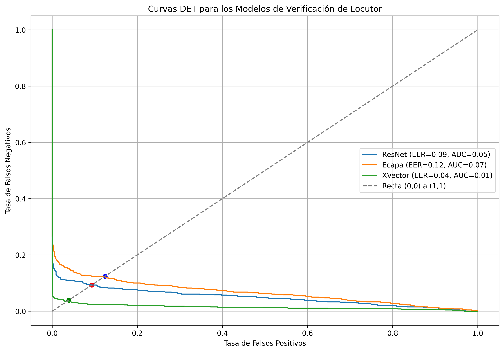
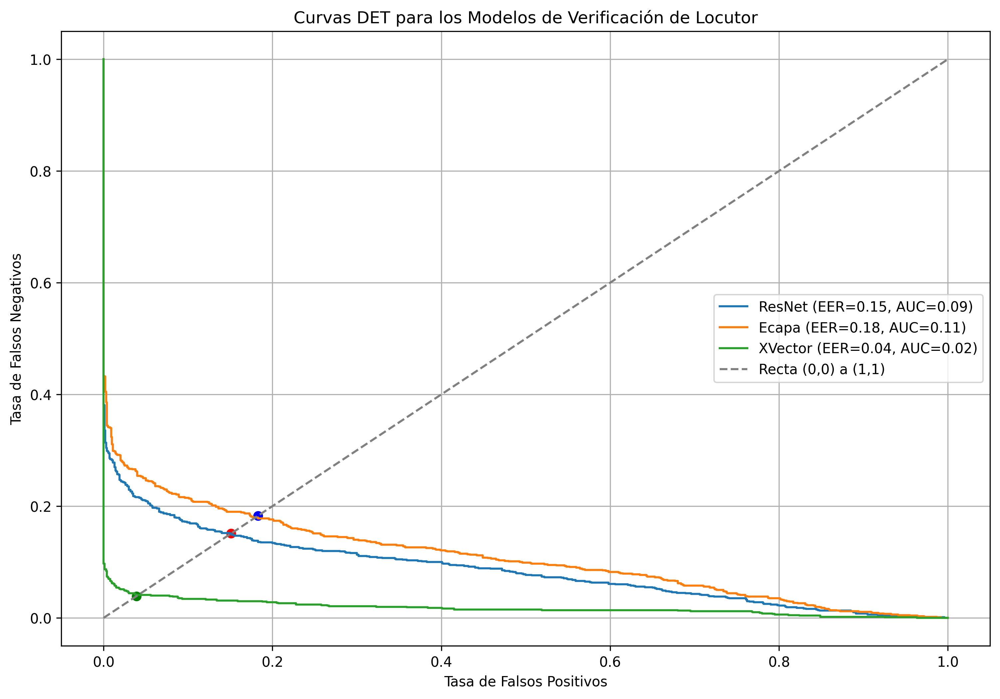
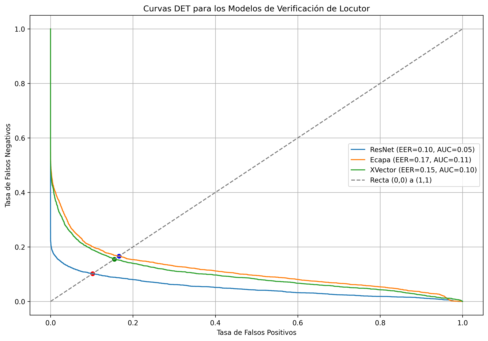

<<<<<<< HEAD
# Verificación Automática del Locutor y Ataques de Spoofing

Este repositorio contiene el código y los recursos asociados a mi Trabajo Fin de Grado (TFG), en el que evalúo el rendimiento de diferentes sistemas de verificación automática del locutor (ASV) frente a ataques de suplantación de identidad utilizando tecnologías de síntesis de voz (TTS).

### Explicación de cada sección:

1. **Descripción del Proyecto**: Explica brevemente en qué consiste el proyecto, su relevancia, y lo que otros pueden encontrar en el repositorio.
2. **Estructura del Repositorio**: Describe cómo están organizados los archivos y carpetas.
3. **Instalación y Requisitos**: Instrucciones para instalar dependencias y clonar el repositorio.
4. **Uso**: Explica cómo ejecutar el código, entrenar modelos, realizar experimentos y cualquier otro paso necesario.
5. **Resultados**: Resumen de los principales hallazgos o gráficos generados en los experimentos.
6. **Contribuciones**: Si aceptas contribuciones de otros, explica cómo hacerlo.
7. **Licencia**: Especifica la licencia bajo la cual publicas el código, si aplica.
8. **Contacto**: Proporciona información de contacto en caso de que alguien quiera hacer preguntas o colaborar.

## Descripción del Proyecto

En este proyecto, se analiza la vulnerabilidad de los sistemas de verificación de locutores basados en redes neuronales ante ataques de **spoofing** generados mediante síntesis de voz. Los sistemas de ASV evaluados incluyen modelos basados en:
- **TDNN**
- **ResNet**
- **ECAPA-TDNN**

Los sistemas de TTS utilizados incluyen:
- **FastSpeech**
- **Tacotron**

Y los **vocoders**:
- **DiffWave**
- **HiFi-GAN**

El objetivo es determinar el rendimiento de los sistemas de ASV frente a estos ataques utilizando la métrica de la Tasa de Error Equivalente (**EER**).

## Estructura del Repositorio

Este repositorio está organizado en las siguientes carpetas y archivos:


- `/codigo`        # Contiene los scripts para los experimentos
- `/documentos`    # Archivos PDF y recursos relacionados con el TFG
- `/resultados`    # Resultados experimentales, gráficos, tablas, etc.
- `README.md`        # Este archivo
- `requirements.txt` # Archivo con las dependencias necesarias

## Instalación y Requisitos

### Requisitos previos

Para ejecutar este proyecto, necesitarás tener instaladas las siguientes dependencias:

- **Python 3.10.9** o superior.
- **speechbrain**
- Las bibliotecas necesarias se encuentran en el archivo `requirements.txt`.

### Instalación de dependencias

1. Clona este repositorio a tu máquina local utilizando el siguiente comando:

    ```bash
    git clone https://github.com/RALYHDB/Evaluacion-sobre-la-aplicabilidad-de-sintetizadores-de-voz-para-la-generaci-n-de-voz-falsificada.git
    
    cd Spoofing
    ```

2. Instala las dependencias ejecutando:

    ```bash
    pip install -r requirements.txt
    ```

Esto instalará todas las bibliotecas necesarias para ejecutar los experimentos.

## Uso

1. Asegúrate de tener todas las dependencias instaladas según los pasos anteriores.
2. Navega a la carpeta `/codigo` donde se encuentran los scripts de los experimentos.
3. Ejecuta los scripts según el experimento que desees realizar.

**AutomatizacionClonacionVozLibriTTS_version2.py** El código clona la voz de un locutor generando un texto largo, dividiéndolo en frases cortas, y luego usa el modelo de síntesis de voz Tacotron 2 y un vocoder HiFI-GAN para convertir esas frases en audio con la voz del locutor. Los archivos de audio generados se guardan en una carpeta específica para cada locutor.

**AutomatizacionClonacionVozLJSpeech.py** El código clona voces generando audios a partir de un texto largo. Primero, se crea un texto de 1000 oraciones del corpus Brown. Luego, se usa el modelo de síntesis de voz FastSpeech2 para convertir frases cortas del texto en espectrogramas, y el vocoder DiffWave para convertir esos espectrogramas en audio. Finalmente, los archivos de audio generados se guardan en una carpeta.

**calculoPuntuaciones** Este código calcula las puntuaciones de similitud entre los embeddings de archivos de audio y un embedding prototipo. Primero, inicializa un clasificador con un modelo de reconocimiento de voz. Luego, carga el embedding prototipo desde un archivo. A continuación, procesa una lista de archivos de audio, calculando embeddings para cada uno. Compara estos embeddings con el prototipo utilizando similitud coseno y guarda los resultados en un archivo .npy. Esto se repite para varios modelos de reconocimiento de voz, generando puntuaciones de similitud para cada uno.

**eer_det_3Modelos.py** Este código se encarga de evaluar y comparar el rendimiento de tres modelos de verificación de locutores utilizando curvas DET (Detection Error Tradeoff) y métricas como el EER (Equal Error Rate) y el AUC (Area Under Curve). Primero, carga las puntuaciones de similitud entre locutores para cada modelo desde archivos .npy. Luego, calcula las tasas de falsos positivos (FPR) y negativos (FNR) a partir de estas puntuaciones y las utiliza para encontrar el EER y el AUC de cada modelo.

Las curvas DET se grafican para cada modelo, mostrando cómo se comportan en términos de FPR y FNR, y se marca el punto de EER en la gráfica. También se grafica la relación entre el umbral y las tasas de FPR y FNR para el modelo ResNet. Finalmente, guarda las gráficas en imágenes PNG.

**generacionEmbeddingPrototipo.py** El código calcula un embedding prototipo a partir de archivos de audio utilizando modelos de verificación de locutores. Extrae embeddings de audio, los promedia para obtener un embedding prototipo y guarda este embedding en un archivo. El proceso se repite para varios modelos y se guarda un archivo para cada uno.

**generacionGraficasROCandDET_teoricas.py** El código genera dos gráficos para evaluar modelos de clasificación: la Curva ROC y la Curva DET. Primero, crea datos simulados para impostores y usuarios con puntuaciones aleatorias. Calcula la tasa de falsos positivos y verdaderos positivos para la Curva ROC, y encuentra el punto de Equal Error Rate (EER) donde ambas tasas son iguales. Luego, calcula y grafica la tasa de falsos positivos y negativos en porcentaje para la Curva DET. Finalmente, se crean dos gráficos mostrando el EER y una línea de referencia, guardando la imagen como curvas_ROC_and_DET.png.

**generacionHistogramaConjuntoLOvsLOS_LI.py** El código realiza varias tareas para evaluar y visualizar el rendimiento de un modelo de verificación de locutor. Primero, define funciones para calcular el EER (Equal Error Rate) y trazar gráficos de tasas de falsos positivos (FPR) y negativos (FNR) en función del umbral. Luego, genera y guarda gráficos que muestran el FPR y el FNR para un modelo específico.

También combina puntuaciones de locutores objetivos y sintetizados desde archivos, y crea un histograma comparativo de estas puntuaciones. La gráfica y el histograma se guardan en un directorio específico.

**generacionPuntuacionesLI.py** El código calcula embeddings de archivos de audio de locutores impostores utilizando un modelo preentrenado, carga embeddings prototipo desde archivos, compara estos embeddings con los prototipos usando similitud coseno y guarda las puntuaciones de similitud en un archivo.

**generacionPuntuacionesLO.py** El código procesa puntuaciones de archivos .npy para diferentes modelos y locutores objetivo. Primero, carga y concatena las puntuaciones desde archivos en una carpeta. Luego, guarda las puntuaciones concatenadas en nuevos archivos. Finalmente, genera histogramas para visualizar la distribución de las puntuaciones de cada modelo

**hallarNumeroSentenciasLocutoresVoxceleb2.py** El código cuenta el número de archivos .wav en subdirectorios para diferentes locutores. Recorre recursivamente las carpetas, cuenta los archivos .wav y almacena estos conteos en un diccionario. Luego, ordena los locutores por el número de archivos en orden descendente, guarda estos resultados en un archivo de texto y también los imprime en la consola.

**histogramasImpostorObjetivo3modelosLJSpeech.py** El script define funciones para crear histogramas continuos de puntuaciones de impostores y reales, tanto para un solo modelo como para varios modelos combinados, carga las puntuaciones desde archivos .npy y genera y guarda histogramas continuos para cada modelo individualmente y una gráfica combinada para todos los modelos.

**representarHistogramaLO_vs_LI.py** El script realiza un análisis de puntuaciones de similitud coseno para diferentes modelos de ASV. Primero, carga y concatena las puntuaciones para locutores objetivos e impostores desde archivos .npy. Luego, genera histogramas de puntuaciones para cada modelo, mostrando las distribuciones de los scores para locutores objetivos e impostores, y guarda las gráficas como imágenes PNG. Además, calcula y grafica las tasas de falsos positivos y falsos negativos en función de un umbral, incluyendo el cálculo del Equal Error Rate (EER) y su umbral correspondiente, guardando estas gráficas también en imágenes PNG. El script crea un directorio para guardar las gráficas y procesa múltiples modelos en un bucle.


## Resultados

En la carpeta `/resultados`, encontrarás:

- **/rendimiento_referencia**: Contiene los histogramas de puntuaciones conjuntos para locutores objetivos (LO) y locutores impostores (LI), tanto agregados como segregados por sexo. Además, incluye los gráficos de las tasas de falsos positivos (FPR) y falsos negativos (FNR) en función del umbral asociado a cada histograma. Los resultados están disponibles para los tres sistemas ASV evaluados.

- **/rendimiento_spoofing**: Está formada por dos subcarpetas:
  - **/LJSpeech**: Muestra histogramas de puntuaciones conjuntos para locutores objetivos (LO), locutores objetivo sintéticos (LOS), y gráficos de FPR y FNR en función del umbral, utilizando la síntesis de voz generada mediante el sistema TTS FastSpeech2 + DiffWave.
  - **/LibriTTS**: Ofrece histogramas de puntuaciones y gráficos similares, pero para la síntesis de voz generada a partir del sistema TTS Tacotron2 + HiFiGAN usando la base de datos LibriTTS.

- **/puntuaciones**: Contiene las puntuaciones generadas en los diferentes experimentos.

- **/prototipos_embeddings**: Almacena los embeddings de los diferentes locutores inscritos en los distintos sistemas de ASV.


### Evaluación del rendimiento de los sistemas ASV en situación estándar:

| Sistema          | Base de Datos              | EER [%] |
|------------------|----------------------------|---------|
| x-vector         | VoxCeleb 2, LibriTTS        | 2.43    |
| ECAPA-TDNN       | VoxCeleb 2, LibriTTS        | 0.27    |
| ResNet           | VoxCeleb 2, LibriTTS        | 0.06    |

### Evaluación del rendimiento de los sistemas ASV en situación de suplantación de identidad:

- Sistema TTS: FastSpeech2 y DiffWave, Base de datos: LJSpeech (1 locutor)

| Sistema      | EER [%] EP-1000 sentencias | EER [%] EP-100 sentencias |
|--------------|----------------------------|---------------------------|
| x-vector     | 3,90                       | 3,90                       |
| ResNet       | 9,30                       | 15,10                      |
| ECAPA-TDNN   | 12,40                      | 18,30                      |

<div style="display: flex; justify-content: space-between;">
  
  
</div>

-Sistema TTS: Tacotron2 y HiFiGAN, Base de datos: LibriTTS (10 locutores sexo masculino (SM), 10 locutores sexo femenino (SF))

| Sistema  | EER [%] (SM) | EER [%] (SF) | EER [%]  |
|----------|--------------|--------------|----------|
| TDNN     | 15,45        | 15,08        | 15,47    |
| ResNet   | 10,63        | 9,62         | 10,20    |
| ECAPA    | 23,11        | 10,79        | 16,63    |




## Contribuciones

Las contribuciones son bienvenidas. Si deseas colaborar, sigue los siguientes pasos:

1. **Fork** este repositorio.
2. Crea una nueva rama para tus cambios (`git checkout -b mi-nueva-rama`).
3. Realiza los cambios necesarios y haz un commit (`git commit -am 'Añadir nueva característica'`).
4. Envía un pull request.

Agradezco cualquier sugerencia, mejora o aporte.

## Contacto

Si tienes alguna duda o sugerencia respecto al proyecto, puedes contactarme a través de:

- **Email:** franlopezh1b@gmail.com
- **LinkedIn:** [tu_perfil_linkedin](https://www.linkedin.com/in/tu_perfil)
"# Evaluaci-n-sobre-la-aplicabilidad-de-sintetizadores-de-voz-para-la-generaci-n-de-voz-falsificada" 
=======
# Verificación Automática del Locutor y Ataques de Spoofing

Este repositorio contiene el código y los recursos asociados a mi Trabajo Fin de Grado (TFG), en el que evalúo el rendimiento de diferentes sistemas de verificación automática del locutor (ASV) frente a ataques de suplantación de identidad utilizando tecnologías de síntesis de voz (TTS).

### Explicación de cada sección:

1. **Descripción del Proyecto**: Explica brevemente en qué consiste el proyecto, su relevancia, y lo que otros pueden encontrar en el repositorio.
2. **Estructura del Repositorio**: Describe cómo están organizados los archivos y carpetas.
3. **Instalación y Requisitos**: Instrucciones para instalar dependencias y clonar el repositorio.
4. **Uso**: Explica cómo ejecutar el código, entrenar modelos, realizar experimentos y cualquier otro paso necesario.
5. **Resultados**: Resumen de los principales hallazgos o gráficos generados en los experimentos.
6. **Contribuciones**: Si aceptas contribuciones de otros, explica cómo hacerlo.
7. **Licencia**: Especifica la licencia bajo la cual publicas el código, si aplica.
8. **Contacto**: Proporciona información de contacto en caso de que alguien quiera hacer preguntas o colaborar.

## Descripción del Proyecto

En este proyecto, se analiza la vulnerabilidad de los sistemas de verificación de locutores basados en redes neuronales ante ataques de **spoofing** generados mediante síntesis de voz. Los sistemas de ASV evaluados incluyen modelos basados en:
- **TDNN**
- **ResNet**
- **ECAPA-TDNN**

Los sistemas de TTS utilizados incluyen:
- **FastSpeech**
- **Tacotron**

Y los **vocoders**:
- **DiffWave**
- **HiFi-GAN**

El objetivo es determinar el rendimiento de los sistemas de ASV frente a estos ataques utilizando la métrica de la Tasa de Error Equivalente (**EER**).

## Estructura del Repositorio

Este repositorio está organizado en las siguientes carpetas y archivos:


- `/codigo`        # Contiene los scripts para los experimentos
- `/documentos`    # Archivos PDF y recursos relacionados con el TFG
- `/resultados`    # Resultados experimentales, gráficos, tablas, etc.
- `README.md`        # Este archivo
- `requirements.txt` # Archivo con las dependencias necesarias

## Instalación y Requisitos

### Requisitos previos

Para ejecutar este proyecto, necesitarás tener instaladas las siguientes dependencias:

- **Python 3.10.9** o superior.
- **speechbrain**
- Las bibliotecas necesarias se encuentran en el archivo `requirements.txt`.

### Instalación de dependencias

1. Clona este repositorio a tu máquina local utilizando el siguiente comando:

    ```bash
    git clone https://github.com/RALYHDB/Evaluacion-sobre-la-aplicabilidad-de-sintetizadores-de-voz-para-la-generaci-n-de-voz-falsificada.git
    
    cd Spoofing
    ```

2. Instala las dependencias ejecutando:

    ```bash
    pip install -r requirements.txt
    ```

Esto instalará todas las bibliotecas necesarias para ejecutar los experimentos.

## Uso

1. Asegúrate de tener todas las dependencias instaladas según los pasos anteriores.
2. Navega a la carpeta `/codigo` donde se encuentran los scripts de los experimentos.
3. Ejecuta los scripts según el experimento que desees realizar.

**AutomatizacionClonacionVozLibriTTS_version2.py** El código clona la voz de un locutor generando un texto largo, dividiéndolo en frases cortas, y luego usa el modelo de síntesis de voz Tacotron 2 y un vocoder HiFI-GAN para convertir esas frases en audio con la voz del locutor. Los archivos de audio generados se guardan en una carpeta específica para cada locutor.

**AutomatizacionClonacionVozLJSpeech.py** El código clona voces generando audios a partir de un texto largo. Primero, se crea un texto de 1000 oraciones del corpus Brown. Luego, se usa el modelo de síntesis de voz FastSpeech2 para convertir frases cortas del texto en espectrogramas, y el vocoder DiffWave para convertir esos espectrogramas en audio. Finalmente, los archivos de audio generados se guardan en una carpeta.

**calculoPuntuaciones** Este código calcula las puntuaciones de similitud entre los embeddings de archivos de audio y un embedding prototipo. Primero, inicializa un clasificador con un modelo de reconocimiento de voz. Luego, carga el embedding prototipo desde un archivo. A continuación, procesa una lista de archivos de audio, calculando embeddings para cada uno. Compara estos embeddings con el prototipo utilizando similitud coseno y guarda los resultados en un archivo .npy. Esto se repite para varios modelos de reconocimiento de voz, generando puntuaciones de similitud para cada uno.

**eer_det_3Modelos.py** Este código se encarga de evaluar y comparar el rendimiento de tres modelos de verificación de locutores utilizando curvas DET (Detection Error Tradeoff) y métricas como el EER (Equal Error Rate) y el AUC (Area Under Curve). Primero, carga las puntuaciones de similitud entre locutores para cada modelo desde archivos .npy. Luego, calcula las tasas de falsos positivos (FPR) y negativos (FNR) a partir de estas puntuaciones y las utiliza para encontrar el EER y el AUC de cada modelo.

Las curvas DET se grafican para cada modelo, mostrando cómo se comportan en términos de FPR y FNR, y se marca el punto de EER en la gráfica. También se grafica la relación entre el umbral y las tasas de FPR y FNR para el modelo ResNet. Finalmente, guarda las gráficas en imágenes PNG.

**generacionEmbeddingPrototipo.py** El código calcula un embedding prototipo a partir de archivos de audio utilizando modelos de verificación de locutores. Extrae embeddings de audio, los promedia para obtener un embedding prototipo y guarda este embedding en un archivo. El proceso se repite para varios modelos y se guarda un archivo para cada uno.

**generacionGraficasROCandDET_teoricas.py** El código genera dos gráficos para evaluar modelos de clasificación: la Curva ROC y la Curva DET. Primero, crea datos simulados para impostores y usuarios con puntuaciones aleatorias. Calcula la tasa de falsos positivos y verdaderos positivos para la Curva ROC, y encuentra el punto de Equal Error Rate (EER) donde ambas tasas son iguales. Luego, calcula y grafica la tasa de falsos positivos y negativos en porcentaje para la Curva DET. Finalmente, se crean dos gráficos mostrando el EER y una línea de referencia, guardando la imagen como curvas_ROC_and_DET.png.

**generacionHistogramaConjuntoLOvsLOS_LI.py** El código realiza varias tareas para evaluar y visualizar el rendimiento de un modelo de verificación de locutor. Primero, define funciones para calcular el EER (Equal Error Rate) y trazar gráficos de tasas de falsos positivos (FPR) y negativos (FNR) en función del umbral. Luego, genera y guarda gráficos que muestran el FPR y el FNR para un modelo específico.

También combina puntuaciones de locutores objetivos y sintetizados desde archivos, y crea un histograma comparativo de estas puntuaciones. La gráfica y el histograma se guardan en un directorio específico.

**generacionPuntuacionesLI.py** El código calcula embeddings de archivos de audio de locutores impostores utilizando un modelo preentrenado, carga embeddings prototipo desde archivos, compara estos embeddings con los prototipos usando similitud coseno y guarda las puntuaciones de similitud en un archivo.

**generacionPuntuacionesLO.py** El código procesa puntuaciones de archivos .npy para diferentes modelos y locutores objetivo. Primero, carga y concatena las puntuaciones desde archivos en una carpeta. Luego, guarda las puntuaciones concatenadas en nuevos archivos. Finalmente, genera histogramas para visualizar la distribución de las puntuaciones de cada modelo

**hallarNumeroSentenciasLocutoresVoxceleb2.py** El código cuenta el número de archivos .wav en subdirectorios para diferentes locutores. Recorre recursivamente las carpetas, cuenta los archivos .wav y almacena estos conteos en un diccionario. Luego, ordena los locutores por el número de archivos en orden descendente, guarda estos resultados en un archivo de texto y también los imprime en la consola.

**histogramasImpostorObjetivo3modelosLJSpeech.py** El script define funciones para crear histogramas continuos de puntuaciones de impostores y reales, tanto para un solo modelo como para varios modelos combinados, carga las puntuaciones desde archivos .npy y genera y guarda histogramas continuos para cada modelo individualmente y una gráfica combinada para todos los modelos.

**representarHistogramaLO_vs_LI.py** El script realiza un análisis de puntuaciones de similitud coseno para diferentes modelos de ASV. Primero, carga y concatena las puntuaciones para locutores objetivos e impostores desde archivos .npy. Luego, genera histogramas de puntuaciones para cada modelo, mostrando las distribuciones de los scores para locutores objetivos e impostores, y guarda las gráficas como imágenes PNG. Además, calcula y grafica las tasas de falsos positivos y falsos negativos en función de un umbral, incluyendo el cálculo del Equal Error Rate (EER) y su umbral correspondiente, guardando estas gráficas también en imágenes PNG. El script crea un directorio para guardar las gráficas y procesa múltiples modelos en un bucle.


## Resultados

En la carpeta `/resultados`, encontrarás:

- **/rendimiento_referencia**: Contiene los histogramas de puntuaciones conjuntos para locutores objetivos (LO) y locutores impostores (LI), tanto agregados como segregados por sexo. Además, incluye los gráficos de las tasas de falsos positivos (FPR) y falsos negativos (FNR) en función del umbral asociado a cada histograma. Los resultados están disponibles para los tres sistemas ASV evaluados.

- **/rendimiento_spoofing**: Está formada por dos subcarpetas:
  - **/LJSpeech**: Muestra histogramas de puntuaciones conjuntos para locutores objetivos (LO), locutores objetivo sintéticos (LOS), y gráficos de FPR y FNR en función del umbral, utilizando la síntesis de voz generada mediante el sistema TTS FastSpeech2 + DiffWave usando la base de datos LJSpeech.
  - **/LibriTTS**: Ofrece histogramas de puntuaciones y gráficos similares, pero para la síntesis de voz generada a partir del sistema TTS Tacotron2 + HiFiGAN usando la base de datos LibriTTS.

- **/puntuaciones**: Contiene las puntuaciones generadas en los diferentes experimentos.

- **/prototipos_embeddings**: Almacena los embeddings de los diferentes locutores inscritos en los distintos sistemas de ASV.


### Evaluación del rendimiento de los sistemas ASV en situación estándar:

| Sistema          | Base de Datos              | EER [%] |
|------------------|----------------------------|---------|
| x-vector         | VoxCeleb 2, LibriTTS        | 2.43    |
| ECAPA-TDNN       | VoxCeleb 2, LibriTTS        | 0.27    |
| ResNet           | VoxCeleb 2, LibriTTS        | 0.06    |

### Evaluación del rendimiento de los sistemas ASV en situación de suplantación de identidad:

- Sistema TTS: FastSpeech2 y DiffWave, Base de datos: LJSpeech (1 locutor)

| Sistema      | EER [%] EP-1000 sentencias | EER [%] EP-100 sentencias |
|--------------|----------------------------|---------------------------|
| x-vector     | 3,90                       | 3,90                       |
| ResNet       | 9,30                       | 15,10                      |
| ECAPA-TDNN   | 12,40                      | 18,30                      |

<div style="display: flex; justify-content: space-between;">
  
  
</div>

-Sistema TTS: Tacotron2 y HiFiGAN, Base de datos: LibriTTS (10 locutores sexo masculino (SM), 10 locutores sexo femenino (SF))

| Sistema  | EER [%] (SM) | EER [%] (SF) | EER [%]  |
|----------|--------------|--------------|----------|
| TDNN     | 15,45        | 15,08        | 15,47    |
| ResNet   | 10,63        | 9,62         | 10,20    |
| ECAPA    | 23,11        | 10,79        | 16,63    |


## Contribuciones

¡Las contribuciones son bienvenidas! Si deseas colaborar, sigue estos pasos:

- Haz un **fork** de este repositorio.
- Crea una nueva rama para tus cambios:  
  `git checkout -b nombre-de-mi-rama`
- Realiza tus modificaciones y haz un commit describiendo los cambios:  
  `git commit -m "Descripción breve de los cambios"`
- Envía un **pull request** para que pueda revisarlo.

Cualquier sugerencia, mejora o aporte es apreciado.

## Contacto

Si tienes alguna duda o sugerencia respecto al proyecto, puedes contactarme a través de:

- **Email:** franlopezh1b@gmail.com
- **LinkedIn:** [Francisco López Houdaibi](https://es.linkedin.com/in/francisco-l%C3%B3pez-houdaibi-4256ab222)

## Referencias

- Ravanelli, M., Parcollet, T., Plantinga, P., Rouhe, A., Cornell, S., Lugosch, L., Subakan, C., Dawalatabad, N., Heba, A., Zhong, J., Chou, J.-C., Yeh, S.-L., Fu, S.-W., Liao, C.-F., Rastorgueva, E., Grondin, F., Aris, W., Na, H., Gao, Y., De Mori, R., & Bengio, Y. (2021). *SpeechBrain: A General-Purpose Speech Toolkit*. arXiv:2106.04624.
  
- Snyder, D., Garcia-Romero, D., McCree, A., Sell, G., Povey, D., & Khudanpur, S. (2018). *Spoken Language Recognition using X-vectors*. Odyssey 2018, 105–111.

- Villalba, J., Chen, N., Snyder, D., Garcia-Romero, D., McCree, A., Sell, G., Borgstrom, J., García-Perera, L. P., Richardson, F., Dehak, R., Torres-Carrasquillo, P. A., & Dehak, N. (2020). *State-of-the-art speaker recognition with neural network embeddings in NIST SRE18 and Speakers in the Wild evaluations*. Computer Speech & Language, 60, 101026. https://doi.org/10.1016/j.csl.2019.101026

- Desplanques, B., Thienpondt, J., & Demuynck, K. (2020). *ECAPA-TDNN: Emphasized Channel Attention, Propagation and Aggregation in TDNN Based Speaker Verification*. Interspeech 2020, 3830–3834. ISCA.

 
>>>>>>> e11309f465fe357207d0ca6109b9f5e03c74101d
